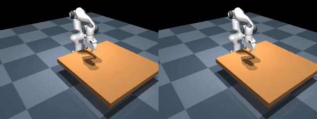
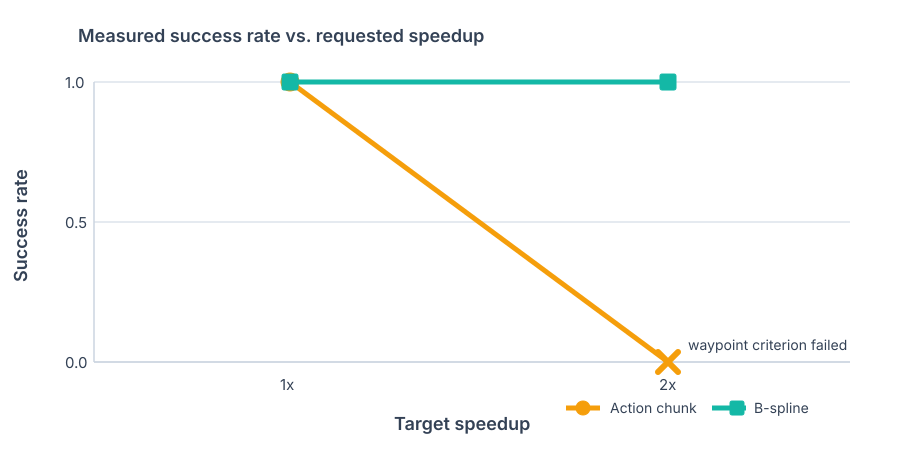

<div align="center">

# SplineFlow-Panda

### Continuous B-spline actions vs. discrete action chunks for a simulated Franka Panda

[](https://www.python.org/)
[](https://mujoco.org/)
[](https://github.com/JayadityaVetsa/SplineFlow-Panda/actions/workflows/ci.yml)
[](#testing)
[](LICENSE)

**[Live dashboard](https://splineflow-panda-z8mhg6j3bgnwsxlinc6rpy.streamlit.app/)** · **[Measured results](results/v0.3-development)** · **[Release videos](https://github.com/JayadityaVetsa/SplineFlow-Panda/releases/tag/v0.3.0)** · **[Reproduce](#reproduce-the-study)**

How much faster can a robot execute the same task with a continuous action representation before tracking error or task failure becomes unacceptable?

| Action chunk at 2x | B-spline action at 2x |
|:---:|:---:|
| Fails the 2 cm waypoint criterion | Completes the same paired layouts |



*Side-by-side measured MuJoCo rollouts. Both methods use the same task, controller, initial condition, and requested 2x speedup.*

</div>

## Result at a glance

The committed development benchmark contains **8 measured MuJoCo rollouts**: two paired direction-change layouts, two action representations, and requested speedups of 1x and 2x. The report is rebuilt from the checked-in rollout ledger—there are no mock measurements in the accepted results path.

| Representation | 1x success | 2x success | Mean successful time at 2x | Reliable frontier |
|---|---:|---:|---:|---:|
| Discrete action chunk | 2 / 2 | 0 / 2 | — | **1x** |
| Continuous B-spline | 2 / 2 | 2 / 2 | **5.00 s** | **2x** |

<div align="center">
  
</div>

The successful 1x action-chunk baseline took 10.00 s. At 2x, both B-spline rollouts finished in 5.00 s while the action chunks exceeded the waypoint-error threshold. This is a small development result, so the repository reports the individual trials and provenance rather than presenting it as a general robotics claim.

The auditable sources are [`rollouts.csv`](results/v0.3-development/rollouts.csv), [`report.json`](results/v0.3-development/report.json), the paired [`layout_manifest.json`](results/v0.3-development/layout_manifest.json), and [`VALIDATION.json`](results/v0.3-development/VALIDATION.json).

## What is the mechanism?

Both methods predict **absolute joint-position commands** and use the same 100 Hz low-level position controller. Only the action representation changes.

| | Action chunk | B-spline action |
|---|---|---|
| Policy update rate | 10 Hz | 10 Hz |
| Command between updates | Hold the latest discrete target | Evaluate a continuous cubic curve |
| Controller sample rate | 100 Hz | 100 Hz |
| Boundary behavior | Can jump between chunks | Continuous within the spline segment |
| Temporal speedup | Skip / compress discrete targets | Retime normalized spline time |

A degree-​`p` B-spline with control points `cᵢ` is

```math
q(t) = \sum_i N_{i,p}(t)c_i.
```

Retiming the same curve by a factor `s` evaluates `q(st)`. Ideally, velocity scales with `s`, acceleration with `s²`, and jerk with `s³`. A larger requested speedup therefore makes controller bandwidth and tracking—not only path geometry—part of the experiment.

```text
paired scene + reference trajectory
                 │
        ┌────────┴────────┐
        │                 │
  action chunk       cubic B-spline
  10 Hz hold         100 Hz sampling
        │                 │
        └────────┬────────┘
                 │
     identical position controller
                 │
        MuJoCo Franka Panda
                 │
   states + contacts + timing → ledger → validated report
```

## Watch the measured rollouts

GitHub Release assets preserve the MP4 recordings outside the repository history.

| Rollout | What it shows | Video |
|---|---|---|
| Action chunk · 1x | Successful reference execution | [Watch MP4](https://github.com/JayadityaVetsa/SplineFlow-Panda/releases/download/v0.3.0/action-chunk-1x-success.mp4) |
| Action chunk · 2x | High-speed waypoint-error failure | [Watch MP4](https://github.com/JayadityaVetsa/SplineFlow-Panda/releases/download/v0.3.0/action-chunk-2x-failure.mp4) |
| B-spline · 2x | Successful continuous high-speed execution | [Watch MP4](https://github.com/JayadityaVetsa/SplineFlow-Panda/releases/download/v0.3.0/bspline-2x-success.mp4) |
| Planar pushing | Contact-rich task demonstration | [Watch MP4](https://github.com/JayadityaVetsa/SplineFlow-Panda/releases/download/v0.3.0/planar-pushing.mp4) |

## Explore the dashboard

The **[live Streamlit dashboard](https://splineflow-panda-z8mhg6j3bgnwsxlinc6rpy.streamlit.app/)** explains the representation, plots the measured frontier, exposes the exact rollout ledger, and includes beginner labs for temporal scaling, spline fitting, tracking, acceleration, and jerk.

The hosted app reads committed artifacts. New physics experiments run locally because the Panda model and native MuJoCo renderer are intentionally not stored in the repository.

## Reproduce the study

### 1. Install

The supported setup is Python 3.11+ with [`uv`](https://docs.astral.sh/uv/):

```powershell
git clone https://github.com/JayadityaVetsa/SplineFlow-Panda.git
cd SplineFlow-Panda
uv sync --all-extras
.\scripts\fetch_menagerie.ps1
.\.venv\Scripts\Activate.ps1
```

The fetch script sparsely downloads only the attributed Franka Panda model from MuJoCo Menagerie.

### 2. Validate one scenario

```powershell
splineflow validate configs/scenarios/direction_change.yaml
splineflow run configs/scenarios/direction_change.yaml
```

### 3. Reproduce the checked-in eight-rollout benchmark

```powershell
splineflow benchmark configs/scenarios/direction_change.yaml --seeds 2 --speedups 1,2
splineflow validate-report benchmarks/<generated-benchmark>
```

Expected qualitative result: both methods pass at 1x; at 2x, action chunks fail the 2 cm waypoint criterion while B-spline actions pass. Small numerical differences can occur across MuJoCo, operating-system, and processor versions.

### 4. Run the planned milestone

```powershell
# Inspect the 240-rollout plan without executing it
splineflow reproduce-milestone --dry-run

# 3 tasks × 2 representations × 4 speedups × 10 paired seeds
splineflow reproduce-milestone --seeds 10 --speedups 1,1.5,2,3
```

This benchmarks direction change, obstacle corridor, and planar pushing. It saves layouts before execution, keeps failed rollouts inspectable, and verifies every aggregate against the ledger.

## Command-line workflows

```text
splineflow validate <config>                 validate a scenario
splineflow plan <config>                     inspect planned trajectories
splineflow run <config>                      execute and record one rollout
splineflow benchmark <config>                run paired representation trials
splineflow validate-report <report>          audit report provenance and aggregates
splineflow reproduce-milestone [options]     reproduce the scripted study
splineflow dashboard                         launch the local dashboard
```

Additional experimental commands generate demonstrations, train matched state-based MLPs, and run open- or closed-loop policy evaluation. See [`docs/learned_policy_status.md`](docs/learned_policy_status.md) before interpreting those outputs.

## Metrics and experiment contract

- **Success rate:** successful paired rollouts divided by all rollouts in the condition.
- **Completion time:** time from the end of settling to the first sustained task success.
- **Achieved speedup:** mean successful 1x chunk time divided by the method's mean successful completion time.
- **Tracking RMSE:** root-mean-square Cartesian commanded-to-executed error.
- **Smoothness:** RMS acceleration and jerk computed with recorded physics timestamps.
- **Safety diagnostics:** forbidden contacts, actuator saturation, and collision-geometry clearance.

Failures reduce success rate and are not converted into infinite completion times. Methods share the same scene, task seed, controller, reference, timing rules, and success predicate. Every accepted dashboard result is labeled as measured scripted MuJoCo, measured learned closed-loop, or open-loop model evaluation.

## Repository map

```text
src/splineflow_panda/   planning, actions, IK, control, simulation, metrics, reports
configs/                validated scenarios and controller settings
results/                compact measured ledger, aggregates, and paired layouts
examples/               small schema-valid experiment bundle
docs/                   learning labs, architecture, metrics, and research context
tests/                  fast unit and integration tests
scripts/                model fetch and release utilities
streamlit_app.py        Streamlit Community Cloud entry point
```

The package owns all robotics and reporting logic. Streamlit is an artifact-driven viewer rather than a second implementation of the experiment.

## Testing

```powershell
ruff check src tests
pytest -m "not slow"
uv build
```

Fast tests cover trajectory mathematics, 6D IK helpers, policy decoding, seed splits, report validation, projection, flow conventions, and provenance. A manually triggered MuJoCo smoke workflow downloads the model and performs a headless rollout. Numerical physics checks use documented tolerances instead of brittle bitwise equality.

## Learning path

The executable labs in [`docs/b_spline_policy_labs.md`](docs/b_spline_policy_labs.md) build the project concepts in order:

1. Position-servo lag and controller bandwidth
2. Jacobians and Cartesian motion
3. Temporal scaling of velocity, acceleration, and jerk
4. Dense sampling versus slower motion
5. Adaptive knots and high-curvature regions
6. Discontinuities between action chunks
7. B-spline segment alignment
8. Why success and completion time belong on the same frontier

## Limitations and research status

- The committed frontier has two paired seeds and one scenario. It validates the pipeline but is not publication-scale evidence.
- Results are simulation-only and do not establish physical-robot performance or safety.
- The headline comparison is a scripted white-box action study. State-based learned policies are experimental and have not passed the repository's publication gate.
- This is a reproduction-inspired educational project, not an official reproduction of B-spline Policy and not a claim of algorithmic novelty.
- Obstacle clearance is evaluated after planning; the planner does not guarantee collision avoidance.
- RGB, metric depth, and segmentation are diagnostics, not policy inputs.
- Fixed end-effector orientation and position control simplify the manipulation problem.

## Citation and attribution

If this repository helps your work, use the metadata in [`CITATION.cff`](CITATION.cff). The action representation study is inspired by:

> Xiaoshen Han, Haoyu Xiong, Haonan Chen, Chaoqi Liu, Antonio Torralba, Yuke Zhu, and Yilun Du. “B-spline Policy: Accelerating Manipulation Policies via B-spline Action Representations.” arXiv:2607.09648, 2026.

MuJoCo and MuJoCo Menagerie are cited separately in [`THIRD_PARTY_NOTICES.md`](THIRD_PARTY_NOTICES.md). Original project code is available under the [MIT License](LICENSE).
